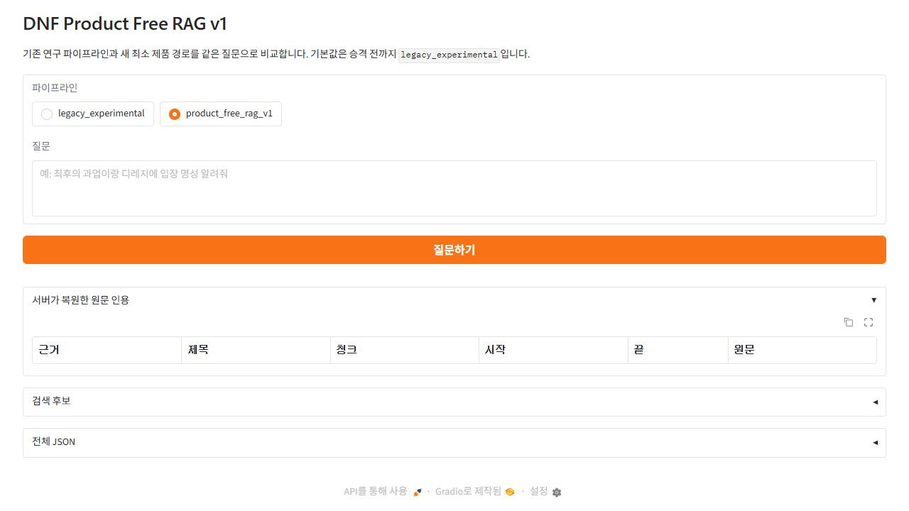

# DNF 공식 문서 QA/RAG — 정직한 측정으로 세 번 바꾼 설계

던전앤파이터 공식 문서에서 답을 찾고, 답의 근거를 원문 좌표까지 복원하는 로컬 QA/RAG 시스템을 만들었다. 이 문서는 가장 높은 숫자만 고르는 성공담이 아니다. SLM 파인튜닝, 타입 계약, 자유 생성형 Product RAG를 차례로 실험하고, 측정이 기대와 다를 때 설계를 바꾼 기록이다.

## 0. 한 눈에

| 무엇을 만들었나 | 현재 구성 | 범위 |
|---|---|---|
| 공식 문서 QA/RAG | BM25 + BGE-M3 → BGE reranker → atomic evidence pack → 조건부 서버 렌더링 또는 Qwen3 8B 1회 → bounded verifier → 서버 인용·표 복원 | 무료·로컬 실행 |
| 평가 체계 | 봉인 세트, SHA 동결, 1회 실행, 사람 근거 검수, adaptive 진단 분리 | 성능보다 측정 정직성 우선 |

| 시스템·평가 | 최종 숫자 | 해석 |
|---|---:|---|
| v3 typed, **sealed** | **37/64** | 타입 계약 시스템의 공식 봉인 결과 |
| Product Free RAG A6, **sealed 자동 채점** | **7/32 (21.9%)** | 표면값 중심 자동 채점 결과 |
| Product Free RAG A6, **sealed 사람 감수** | **20/32 (62.5%)** | 봉인 출력을 근거와 대조해 확정한 공식 결과 |
| 숫자 해석 제한 | 비교 금지 | 64문항과 32문항은 서로 겹치지 않는 다른 벤치마크이며 난이도도 통제되지 않았다. 어느 시스템이 더 낫다는 비교에는 사용할 수 없다. |

| 판정 대상 | 판정 | 이유 |
|---|---|---|
| 포트폴리오 공개 | **GO** | 성공뿐 아니라 실패, 측정 오류, 기각한 개선안까지 재현 가능하게 남김 |
| Product Free RAG 제품 기본 경로 승격 | **NO-GO** | A6 사람 감수 정확도가 목표 80%에 미달하고 한 건의 unsupported overclaim이 남음 |

## 1. 문제 정의

공식 문서 QA는 “관련 문서를 찾고 문장을 요약한다”로 끝나지 않는다. 같은 단어와 숫자가 한 문서 안에서 다른 조건을 가질 수 있고, 게시 시점과 적용 시점이 다르며, 표의 셀 안 대상명과 표 전체를 지배하는 주어가 다를 수 있다.

대표 사례가 A6-7이다. 공식 업데이트에는 같은 스킬 이름을 포함한 값 두 쌍이 있다.

```text
- 타이드 바운드 -
쿨타임이 감소합니다. (20초 → 18초)

- '질풍' 스킬 개화 옵션이 변경됩니다.
| 변경 전 | 변경 후 |
| [타이드 바운드] ... 기본 쿨타임 12초 ... |
| [타이드 바운드] ... 기본 쿨타임 9초 ... |
```

질문의 첫 요구는 평시 타이드 바운드의 `20초 → 18초`, 두 번째 요구는 질풍 개화 조건의 `12초 → 9초`다. 숫자는 모두 문서에 있지만 조건을 하나 놓치면 존재하는 숫자로 틀린 답을 만들게 된다. 이 사례의 원문 청크와 좌표는 [A6 adaptive replay](reports/v3/product_free_rag_a6_pending_adaptive_replay_20260806.jsonl)에 보존돼 있다.

시간도 답의 일부다. 이벤트의 진행 여부, 판매 기간, 정책 revision은 질문의 기준일에 따라 답이 달라진다. 그래서 현재·최신·진행 중·전체 개수처럼 집합 연산이 필요한 질문은 메타데이터 경로로 보내고, 특정 문서의 사실은 일반 RAG로 처리한다.

표는 더 까다롭다. 행 안에는 `[타이드 바운드]`가 적혀 있지만, 바로 위 도입문은 그 행이 `'질풍' 스킬 개화 옵션`임을 규정한다. 셀만 잘라 검색하거나 생성하면 “표에 있는 값”과 “질문한 대상의 값”이 분리된다.

## 2. 세 번의 방향 전환

첫 방향은 작은 언어 모델을 도메인에 파인튜닝하는 것이었다. 동일 검색 조건에서 RAG-only, base Qwen, LoRA tuned Qwen을 비교했다. tuned 모델은 Partial 처리와 형식 준수에서 개선됐지만, 개봉 전 게이트인 fresh false joint와 unsupported 명시적 거절을 통과하지 못했다. blind 100문항은 열지 않았고 SLM 파인튜닝을 제품 경로로 밀어붙이지 않았다.

두 번째 방향은 생성을 강한 타입 계약으로 묶는 것이었다. 모델이 `subject`, `relation`, typed `value`, `evidence_ref`를 출력하고 서버가 다단계로 검증했다. **sealed 37/64**를 얻었지만 96개 요구 중 명시적 relation 계약은 **22개**뿐이었다. 알려진 관계를 안전하게 다루는 대신 새로운 표현과 관계를 받기 어려워 실사용 경로로 승격하지 않았다. 근거는 [v3 봉인 결과](reports/v3/typed_evidence_ref_generalization_64_relation_group_currency_v2.json)와 [96개 relation inventory](reports/v3/typed_evidence_ref_relation_inventory_96_20260727.json)에 있다.

세 번째 방향은 모델에게 질문 해석과 문장 작성을 돌려주되, 서버가 짧고 좋은 근거와 최소 안전장치를 제공하는 것이었다. 이것이 현재 실험 경로인 Product Free RAG v1이다. 공식 A6 봉인 출력의 사람 감수 결과는 **sealed 20/32**다. 이 숫자는 앞의 37/64와 다른 문항·다른 시스템에서 나온 값이며 두 결과 사이의 우열을 뜻하지 않는다.

## 3. 데이터 구축

### 3-1. 공식 문서를 재현 가능한 스냅샷으로

수집 범위는 던파 공식 게시판·게임 가이드·FAQ·세라샵·운영정책과 이미지 의존도가 높은 `/pg/` 상세 페이지다. `discover_sources → collect_details`를 분리해 목록에서 찾은 URL과 실제 수집 성공을 따로 기록했고, 동일 라운드에서는 `fetched_at`을 고정했다. 현재 Product 스냅샷은 **2026-08-07 기준 문서 996개·청크 3,925개**다. 문서와 청크 수는 [normalized corpus manifest](data/v3/normalized/normalized_corpus_manifest_ebf0a8514591e88def4157aa2b97b9d3e67a53b60586a6693b54ec13c52d1003.json)와 [chunk corpus manifest](data/v3/chunks/chunk_corpus_manifest_a06f9afffd567023ff9351dc1cabc9bd632ab90d4c0754e99a108a118ce90ced.json)에 고정했다.

### 3-2. 페이지 종류별 파서와 정규화

게시판·가이드·정책·이벤트 페이지는 DOM 구조가 다르다. 제목 일치, FAQ locator, 정책 revision, 표와 heading, 내비게이션 잔여물을 각각 검사하고 실패한 상세 페이지를 정상 문서로 넣지 않았다. `/pg/` 이벤트 19개도 전용 selector로 다시 수집해 DOM 청크 0개인 문서는 없게 만들었다. OCR을 제외한 `retrieval_text` 합계는 페이지별로 **362자(`aradfishing`)~29,841자(`tropicalpkg`)**였고 19개 중 5개에 시각 근거를 별도로 붙였다. 파서 변경과 원본 snapshot은 [detail parser hardening](docs/v3/detail_parser_hardening.md)에 기록했다.

### 3-3. 표·시간을 본문 사실로 보존

표는 행을 평문으로 흩뜨리지 않는다. 완전한 표 청크와 검색용 atomic row를 함께 만들고, 행의 주어가 직전 도입문에 있을 때 그 문맥을 좌표와 분리해 보존한다. 신규 미카엘라 비교표가 드러낸 병합 셀 손실도 `rowspan/colspan`을 해석해 아이템·난이도·수량을 한 행에 결속하도록 [구조화 파서](src/v3/harden_detail_parsers.py#L124)에 고정했다. 별도 상세 수집에서는 여러 HTML 신호 중 숫자형 `eventRewardPop(...)` 규약만 채택했다. 시점이 있는 문서는 `status`, `revision_id`, `valid_from`, `valid_to`를 붙여 게시일과 적용일을 구분한다. 현재·최신·진행 중 같은 집합 질문은 이 메타데이터로 계산하고, 특정 문서 사실은 일반 검색으로 보낸다. 구현 근거는 [table atomic facts](docs/v3/table_atomic_facts_arm1.md), [structured detail 결과](docs/v3/structured_detail_enrichment_results_20260809.md), [temporal policy](docs/v3/temporal_policy.md)다.

### 3-4. 문서 해시와 좌표 변동의 실제 범위

청크 ID는 전역 순번이 아니라 `parent_document_id + offset_source + start/end + display hash + chunker version`의 해시다. 그런데 `parent_document_id`가 문서 전체 content hash를 포함하므로, 본문 밖 동적 값 하나만 달라져도 같은 근거 문장의 모든 자식 좌표가 바뀐다. 실제 계약은 [build_chunks.py:124](src/v3/build_chunks.py#L124)에 있다.

2026-08 갱신에서 기존 3,599개 중 1,330개 ID만 유지됐고 봉인 A6 좌표는 8/33만 남았다. 소멸 25건은 현재 월간 상품 모듈 혼입 8건, 조회수·회전형 배너 alt 9건, 정책 접근 날짜 4건, 실제 상품 변경 1건, 문서 미보존 3건이었다. 원인과 좌표는 [봉인 좌표 게이트 보고서](docs/v3/corpus_refresh_k2_sealed_gate_failure_20260809.md)에 보존했다.

동적 오염 선택자 `ul.thismonth`, `span.hits`, `article.bdview_bnrarea`, `select#revisionList`를 제거하면 두 수집분은 16/16 일치했다. 그러나 정제 결과는 기존 canonical과 0/16 일치하는 제3의 해시였다. 따라서 오염 제거는 향후 좌표를 안정화하는 수단이지 과거 좌표 복원 수단이 아니다. 이 판단 때문에 33/33 게이트를 통과 조건에서 측정 항목으로 내렸다. [동적 오염 조사](reports/v3/dynamic_contamination_survey_20260809.json)

인용 결과 파일에는 좌표와 함께 원문 `text`를 저장하므로 과거 실행의 인용 내용은 재감사할 수 있다. 다음 갱신은 ID 유지율을 기록하되, 실제 근거 본문과 revision 보존 여부를 승격 판단의 중심에 둔다.

### 3-5. OCR은 수집했지만 검색에는 넣지 않았다

원본 청크를 `visual_ocr`와 나머지로 나눠 같은 문자열을 세면 OCR 오류가 드러난다.

| 표기 | DOM 청크(정답 표기) | OCR 청크 |
|---|---:|---:|
| `천해천` | 120 | 4 |
| `천해선`·`전해선`·`전해전` | 0 | 5 |
| `캐릭터` | 2,432 | 9 |
| `개릭터`·`개력터` | 0 | 8 |
| `인파이터(여)` | 157 | 4 |
| `인파이터(어)` | 0 | 2 |

지역명은 OCR 9회 중 5회(56%), `캐릭터`는 17회 중 8회(47%)가 오표기였다. 특히 `인파이터(여) → 인파이터(어)`는 철자 문제가 아니라 다른 직업을 만들 수 있다. 반대로 아라드 낚시왕의 DOM 362자에는 `던전 10회`, `계정당 매일 1회`, `오전 06시 초기화`가 이미 있었고 OCR에는 무관한 보안 경고가 섞였다. 따라서 `visual_ocr` **22/3,599** 청크는 `evidence_quality=unverified_ocr`, `review_required=true`, `default_exposure=false`로 격리하고 [build_bm25.py:172](src/v3/build_bm25.py#L172)에서 검색 색인에서 제외했다.

OCR 구조 복원 Arm 7은 **NO_GO_PRECONDITION**이다. word/line bbox, 사람이 검수한 visual gold, 안전 경계, 행·셀 복원 지표와 false-structure 0 계약이 먼저 필요하다. 원본 좌표를 주지 않는 VLM보다 bbox를 주는 OCR 경로를 다음 후보로 남겼다. 판단 근거는 [OCR structure readiness](docs/v3/ocr_structure_readiness_arm7.md)다.

## 4. 검색과 근거 선별

### 4-1. 서로 다른 실패를 보완하는 hybrid

BM25는 고유명사·숫자에 강하고 BGE-M3 dense 검색은 패러프레이즈에 강하다. 두 top-20의 합집합을 문항별 min-max 정규화한 뒤 **BGE-M3 0.75 + BM25 0.25**로 결합한다. 작은 adaptive retrieval dev에서 dense 단독 대비 hit@10은 `0.9455→0.9636`, all-groups@10은 `0.9273→0.9455`, group recall@10은 `0.9322→0.9492`였다. 최저 출처 엄격 개선은 실패해 당시 계약상 승격은 NO-GO였지만, 후속 promoted runtime의 고정 검색 backbone으로 사용했다. 원 실험은 [hybrid fusion contract](docs/v3/hybrid_fusion_contract.md)에 있다.

### 4-2. reranker와 후보 다양성

같은 hybrid 후보를 BGE reranker로 재정렬한 개발 A/B는 다음과 같다.

| arm | all-groups hit | group recall | 주석 정밀도 | 평균 근거 수 |
|---|---:|---:|---:|---:|
| baseline selector | 0.981818 | 0.983051 | 0.129754 | 8.127273 |
| reranker top-3 | 0.945455 | 0.932203 | 0.333333 | 3.000000 |
| reranker top-8 | 0.981818 | 0.983051 | 0.131818 | 8.000000 |
| adaptive 3/8 | 0.981818 | 0.983051 | 0.290000 | 3.636364 |

recall을 유지하면서 정밀도를 높인 adaptive 3/8도 절대 정밀도 0.5 미만, semantic contradiction 미측정, 독립 holdout 부재 때문에 production selector로는 NO-GO였다. 수치는 [reranker A/B report](reports/v3/evidence_reranker_ab_763ca7b93bec87e475a4406f24b7780ebaeadffb7a36b494c473452244d8c90f.json)에 있다.

제품 경로는 전체 질문과 요구 절을 각각 검색해 union하고, 같은 parent 문서가 결과를 독점하지 않도록 parent당 최대 2개를 남긴다. atomic prefilter 뒤에는 요구별 후보를 예약하고 최대 8개를 `E1`~`E8`로 압축한다. top-2는 복수 요구를 잃었고 무조건 top-8은 노이즈가 컸기 때문에, 가시성·요구별 예약·상한을 분리했다. 현재 남은 S1 검색 실패는 A6 slot 22 한 건이다.

### 4-3. 좋아 보였지만 버린 검색 개선

| 실험 | 관찰 | 결정 |
|---|---|---|
| federated retrieval | 누락 7건 중 4~5건 복구, 그러나 grounded `73/82→63/82`, false-full `9/82→18~19/82` | NO-GO |
| requirement-query retrieval | 누락 복구 `0/7`, grounded `64/82` 또는 `63/82`, false-full `18~19/82` | NO-GO |
| claim-aware reranker | 인용 group hit `47→56`, 회귀 0; strict mismatch 3건·독립 holdout 없음 | adaptive runtime만 GO, production NO-GO |
| corpus retrieval hygiene | 검색 텍스트 560/3,599 변경 뒤 grounded `73/82→72/82`, false-full `9/82→10/82` | NO-GO |

넓은 후보가 retrieval miss를 줄여도 새 오답을 더 만들 수 있었다. 그래서 검색 실험은 hit만 보지 않고 grounded, false-full, exact slice, 시간·실시간 안전 회귀를 함께 판정했다. 원본은 [federated report](reports/v3/federated_retrieval_ab_0e48bfbc2d69d6b524b98b83c79d0ff296540ba05374e72cd1ec6f0616a5172c.json), [requirement report](reports/v3/requirement_retrieval_ab_ff945c4b87b691b248ced8a3541ba53cd025f41183dd03de5dddf00ae8b45cd9.json), [claim reranker report](reports/v3/claim_reranker_runtime_f37db5f17f3d20553d14922471c5bf7415ff942b12746dfad6d831a6a0ef1df9.json), [hygiene report](reports/v3/corpus_hygiene_remeasurement_de715ef3918e4b0198af88b33acd87d6417acc89b59e0c278c1861668f153e96.md)다.

## 5. 평가 설계

### 5-1. 왜 먼저 봉인하는가

개발 문항을 본 뒤 점수가 오르도록 고치면 같은 문항의 재실행은 일반화 측정이 아니다. 이 프로젝트는 문항·정답 계약을 사람이 검수하고 SHA로 동결한 뒤 정확히 한 번 실행한다. A6 frozen set SHA는 `9405401d76c87b28418b795716938a3d62578644f33f2e853ddf18fc689b65dc`, freeze manifest SHA는 `4d47ef5d760fdb589fd1a81217d52908a77bd76a78b875384cd2315880c78499`다. 실행 후에는 원본을 고치지 않고 판정 overlay만 append-only로 남긴다.

```text
평가 계약·게이트 작성 → 사람 문항 검수 → JSONL·manifest SHA 동결
→ 1회 실행 → 출력 공개 → 이후 실험은 adaptive로만 표기
```

### 5-2. sealed와 adaptive를 섞지 않는다

sealed는 공개 전 성능 주장이고 adaptive는 공개된 문항·저장 출력으로 원인을 찾는 진단이다. A6 adaptive 사람이 읽은 결과가 **24/32 (75.0%)**여도 공식 헤드라인은 **sealed 20/32 (62.5%)**다. 문항을 실행하기 전에 성공·회귀·false-full·인용·지연 gate를 먼저 문서화했다. 현재 git이 추적하는 `docs/v3/` 계약·진단 문서는 **137개**다. 문서 수 자체가 품질은 아니지만, 결과를 본 뒤 기준을 바꾸지 않았는지 감사하는 원장이다.

### 5-3. 모델과 체크포인트도 end-task gate로 고른다

v1/v2에서 clean step-264는 checkpoint-250보다 dev loss가 낮았지만 fresh/human Partial citation과 joint는 더 나빴다. “더 오래 학습”이나 “낮은 loss” 대신 고정된 end-task dev gate로 checkpoint를 선택했다. 비교 원본은 [portfolio report](PORTFOLIO_REPORT.md)와 [final dev comparison](reports/final_dev_system_comparison.json)에 있다.

### 5-4. 채점기도 평가 대상이다

동일한 A6 저장 출력이 자동 채점에서는 **sealed 7/32 (21.9%)**, 원문을 대조한 사람 감수에서는 **sealed 20/32 (62.5%)**였다. 자동 scorer는 날짜 축약, 값 어순, 서버가 복원한 표, 정상 partial을 놓쳤다. 그래서 자동 점수는 빠른 회귀 신호로 유지하되 최종 의미 품질을 대표하지 않는다. 반대로 사람 감수도 slot 22 overclaim과 slot 6 gold 오류를 이유·좌표와 함께 남겨 재감사 가능하게 했다.

## 6. 1막 — SLM 파인튜닝을 접은 판단

목표는 0.5B급 SLM이 공식 문서 근거를 읽고 `answerability`, 답변, 인용을 안정적으로 출력하게 만드는 것이었다. BGE-M3 hybrid 검색 조건을 고정한 뒤 RAG-only, base Qwen2.5-0.5B, clean LoRA tuned Qwen을 세 축으로 비교했다.

다음 두 표는 봉인 성능이 아니라 모델 선택에 사용한 **adaptive development evaluation**이다. Fresh conversational dev 30문항 결과는 다음과 같다.

| 지표 | RAG-only | Base Qwen + RAG | Clean tuned Qwen + RAG |
|---|---:|---:|---:|
| schema compliance | 30/30 | 0/30 | 30/30 |
| answerable true | 16/16 | 0/16 | 15/16 |
| exact citation | 14/22 | 0/22 | 14/22 |
| Partial joint | 0/6 | 0/6 | 3/6 |
| false joint | 5/8 | 0/8 | 5/8 |
| retrieval expected hit | 21/22 | 21/22 | 21/22 |

사람이 검수한 Partial dev 20문항에서는 tuned 모델의 장점과 한계가 더 분명했다.

| 지표 | RAG-only | Base Qwen + RAG | Clean tuned Qwen + RAG |
|---|---:|---:|---:|
| schema compliance | 20/20 | 0/20 | 20/20 |
| exact citation | 6/20 | 0/20 | 12/20 |
| Partial joint | 0/20 | 0/20 | 8/20 |
| strict requirement joint | 0/20 | 0/20 | 3/20 |
| grounded and cited slots | 6/31 | 0/31 | 11/31 |
| unsupported explicit abstention | 0/21 | 0/21 | 8/21 |
| unsupported overanswer | 2/21 | - | 0/21 |

따라서 “RAG-only가 모든 면에서 tuned보다 낫다”도, “tuned가 제품 준비를 끝냈다”도 아니었다. tuned는 구조와 Partial에서 좋아졌지만, blind 개봉 전 사전 게이트는 fresh false joint `7/8 이상`과 unsupported explicit abstention `14/21 이상`이었다. 실제 결과는 각각 `5/8`, `8/21`이어서 frozen blind 100문항을 소모하지 않았다. 학습을 더 돌리는 대신 제품 문제를 검색·근거·검증의 구조 문제로 다시 정의했다.

데이터 구축, RAFT, 누수 검사, 체크포인트 선택의 상세 기록은 [DNF Domain QA SLM/RAG v2](PORTFOLIO_REPORT.md)에 남겨 두었다. 위 수치의 집계 근거도 해당 문서 §7과 [final comparison artifacts](reports/final_dev_system_comparison.json)에 있다.

## 7. 2막 — 타입 계약 파이프라인 (v3)

v3 typed 경로는 자유 문장 하나가 아니라 “무엇에 대한 어떤 값이며 어느 근거가 증명하는가”를 모델 출력에 포함시켰다.

```json
{
  "subject": "최후의 과업",
  "relation": "입장 명성",
  "value": {"type": "number", "value": 108921},
  "evidence_ref": "E1"
}
```

서버 검증은 다섯 층이었다.

1. typed value와 출력 스키마가 계약을 지키는지 확인한다.
2. `evidence_ref`가 제공된 근거이고 원문 청크 좌표가 exact slice인지 확인한다.
3. revision과 질문의 시간 조건이 맞는지 확인한다.
4. subject·relation·value가 같은 evidence group 안에서 결속되는지 확인한다.
5. 숫자·화폐·날짜·시각을 정규화한 뒤 인용 근거의 값과 일치하는지 확인한다.

공식 성능 주장은 [봉인 64문항 결과](reports/v3/typed_evidence_ref_generalization_64_relation_group_currency_v2.json)의 **sealed 37/64**다. 후속 replay에서 점수가 달라진 경우도 있지만 저장 출력 재채점과 adaptive 진단이므로 봉인 헤드라인을 대체하지 않았다.

승격하지 않은 결정은 성능 숫자 하나보다 계약의 외연 때문이었다. 봉인 결과를 연 뒤 수행한 **adaptive contract audit**인 [96개 요구 inventory](reports/v3/typed_evidence_ref_relation_inventory_96_20260727.json)에서 고유 relation은 73개였고, 명시적 alias 계약은 **22/96**, 나머지 74개는 unvalidated였다. 관계 이름을 계속 등록하면 알려진 질문은 통제할 수 있지만 질문 표현이 늘 때마다 서버가 먼저 의미를 규정해야 했다. 이 구조는 연구 파이프라인으로 보존하고 제품 경로에서는 제거했다. 상세 설계는 [typed v3 기록](PORTFOLIO_V3_DRAFT.md)에 있다.

## 8. 3막 — Product Free RAG (현재)

### 8-1. 파이프라인

```text
질문
→ Unicode·띄어쓰기 정규화
→ 집합 연산 질문만 metadata routing
→ 전체 질문 + 요구 절별 검색
→ BM25 top 20 + BGE-M3 top 20 (0.25 / 0.75 hybrid)
→ 질의별 결과 union
→ BGE reranker
→ top 8, parent 문서당 최대 2개
→ atomic evidence pack 최대 8개
→ 구조가 충분한 비교·종류·보상 표면 서버 결정 렌더링
   └─ 그 외 질문만 Qwen3 8B 한 번
→ 인용·핵심값·날짜·질문 관계 bounded deterministic 검증
→ 서버가 원문 인용과 완전한 표를 복원
```

기억에 의존하지 않고 현재 코드의 상수를 확인했다. [retrieve_v3.py](src/v3/retrieve_v3.py)는 BM25와 dense 후보를 각각 20개까지 찾고 BGE-M3에 0.75, BM25에 0.25를 둔다. [product_free_rag.py](src/v3/product_free_rag.py)는 전체 질문과 요구 절을 중복 제거한 뒤 각 질의의 top 20을 합치고, `BAAI/bge-reranker-v2-m3`로 재정렬한다. 최종 후보는 8개이며 같은 parent는 최대 2개다.

atomic pack은 후보 청크를 관련 문장·표 행 단위로 자른다. Qwen에게 긴 SHA와 좌표를 쓰게 하지 않고 `E1`~`E8`만 보인다. atomic prefilter는 요구 질의당 32개, 복수 요구에서는 질의당 3개를 먼저 예약한다. 순수한 2축 O/X 비교표와 구조가 충분한 콘텐츠 종류·보상 종류 표는 서버가 결정적으로 렌더링한다. 그 조건에 맞지 않는 질문만 `qwen3-8b:ctx8192`를 입력 context 4,096토큰·출력 768토큰 한도에서 한 번 호출한다. 완전한 표는 Qwen이 다시 쓰지 않고 서버가 원문 행을 렌더링한다.

검증기는 선택한 E번호가 실제 pack에 있는지, 답의 숫자·날짜·시각·화폐가 인용 근거에 있는지, 질문에 명시된 시간·관계 조건과 근거가 맞는지를 본다. 표 주어·관계 결속, 비교값, preview 노출 경계까지 다루므로 현재 구현을 “네 가지뿐인 최소 검사”라고 부르지는 않는다. 자연어 모든 토큰의 포함이나 relation 이름 허용목록은 제품 경로의 계약으로 사용하지 않는다. 거절된 claim은 사용자 답에서는 제거하지만 내부 `rejected_claims`에 남겨 실패 원인을 감사할 수 있다.

### 8-2. 공식 A6 결과

공식 A6 자동 채점은 **sealed 7/32 (21.9%)**, 동일 저장 출력의 사람 감수는 **sealed 20/32 (62.5%)**였다. 약 40%p 차이는 모델이 갑자기 좋아진 것이 아니라 측정기가 날짜 축약, 값의 어순, 표 서버 렌더링, 정상 partial을 놓친 결과다. 예를 들어 `2025-09-11`과 `25.09.11`, `숫자 6자리`와 `6자리 숫자`를 다른 값으로 보거나, Qwen이 아니라 서버가 복원한 완전한 표를 claim overlap만으로 실패 처리했다.

사람 감수는 모델에게 유리한 정답만 추가하는 절차가 아니었다. slot 22의 근거 없는 보고 채널·기한은 unsupported overclaim 한 건으로 남겼다. 반대로 slot 6에서는 공식 원문이 “태초 서약 중 1종을 균등한 확률로 획득”한다고 말하는데 frozen gold가 그 답을 unsupported로 둔 오류를 발견했다. 봉인셋은 고치지 않고 [append-only 판정 overlay](reports/v3/product_free_rag_a6_slot6_readjudication_20260806.json)에 `gold error 1`로 기록했다.

공식 sealed A6의 다른 안전·효율 수치는 false-full 0, 인용 좌표 32/32, 생성 오류 0, 평균 입력 1,923.4토큰이다. 자동 scorer의 value+claim complete는 29/61이었다. 공식 사람 판정의 남은 실패 슬롯은 `1, 2, 4, 7, 10, 11, 13, 14, 22, 26, 28, 32`이며 제품 기본 경로 승격은 NO-GO다.

2026-08-10 최초 승격은 롤백했지만, 다음 날 재감사에서 공식 7월 보관 문서가 후보 안에 있음을 확인했다. 실제 원인은 과거 월 질문이 보관 상태를 검색 전에 제외한 것이었고, 이를 일반화해 `product_free_rag_v1`만 새 스냅샷으로 승격했다. §12-2에 정정 과정을 기록한다.

## 9. 실패 분석

### 9-1. 어디서 답이 사라졌는가

실패를 한 덩어리의 “정확도”로 부르지 않고 최초 손실 단계에 귀속했다.

| 단계 | 의미 | 공식 one-shot 실패 요구 | adaptive 실패 요구 |
|---|---|---:|---:|
| S1 | 검색 후보에 정답 문서가 없음 | 1 | 1 |
| S2 | 후보에는 있지만 pack이 정답 단위를 고르지 못함 | 5 | 1 |
| S3 | 근거를 받았지만 생성이 누락·오연결 | 3 | 3 |
| S4 | 맞는 claim을 verifier가 제거 | 4 | 3 |
| S5 | 존재하는 값을 다른 관계·대상에 결속 | 1 | 0 |
| 합계 | 요구 단위 | 14 | 8 |

공식 열은 봉인 one-shot, adaptive 열은 ranking context와 요구 예약을 적용한 진단 결과다. 같은 척도의 제품 점수 비교가 아니라 손실 위치를 찾기 위한 단계 귀속이다. 세부 요구별 이동은 [adaptive 적용 보고서의 A5](reports/v3/product_free_rag_pending_apply_and_adaptive_replay_20260806.md)에 있다.

### 9-2. A6-7 — 정보를 모두 줘도 조건이 떨어졌다

원문 청크 `chunk_sha256_b85cf9c381f143cf45072d4a3738bdb2bebdba4634eb37cd962defa2798fc3f6`에는 두 정답이 모두 있다.

```text
서버 근거 단위 189:224
  frozen gold 191:224  타이드 바운드 - 쿨타임이 감소합니다. (20초 → 18초)

frozen gold 273:430
  표 도입: - '질풍' 스킬 개화 옵션이 변경됩니다.
  [타이드 바운드] ... 기본 쿨타임 12초 → 9초
```

adaptive 실행에서 모델이 받은 핵심 evidence JSON도 이미 주어 문맥을 포함했다.

```json
[
  {
    "evidence_ref": "E1",
    "text": "| [타이드 바운드] ... 기본 쿨타임 12초 ... | ... 기본 쿨타임 9초 ... |",
    "context_text": "표 도입: - '질풍' 스킬 개화 옵션이 변경됩니다."
  },
  {
    "evidence_ref": "E2",
    "text": "- 타이드 바운드 - 쿨타임이 감소합니다. (20초 → 18초)"
  }
]
```

그런데 한 번 호출한 모델은 다음처럼 답했다.

```text
타이드 바운드 쿨타임은 12초에서 9초로 줄었습니다.
질풍 개화 옵션의 기본 쿨타임은 12초에서 9초로 바뀌었습니다.
```

결정적 실험은 요구별 fan-out이었다. 첫 질문만 준 호출에서도 표 행 `F1E1`을 타이드 바운드 본체에 결속해 `12→9`를 만들었고, 두 번째 질문만 준 호출에서는 같은 원문 단위 `F2E1`을 질풍 옵션에 결속해 올바른 `12→9`를 만들었다. 동시에 첫 호출은 별도 근거에서 올바른 `20→18`도 생성했다. 즉 검색 누락도, 숫자 환각도 아니었다. 문서 안에 실제로 있는 숫자에서 **조건만 탈락**했다. [fan-out 엄격 재채점](docs/v3/product_free_rag_requirement_fanout_experiment_results_20260806.md)은 핵심 게이트를 0/2로 판정했다.

이 실패에 여섯 번 접근했지만 모두 승격하지 않았다. 아래 결과는 공개된 A6-7을 대상으로 한 **adaptive 진단**이다.

| 시도 | 겨냥한 문제 | 관찰과 결정 |
|---|---|---|
| 표 주어 결속 | 도입문을 evidence context에 추가 | `'질풍'` 문맥이 이미 모델 입력에 있었지만 첫 답은 계속 `12→9`; NO-GO |
| ranking context | 도입문을 근거 순위에도 사용 | 정답 두 단위가 pack에 함께 있어도 오결속 유지 |
| 절 분해 F0 | 복수 요구를 Kiwi로 분리 | 목표 8/8은 복구했지만 비목표 과분해와 A6-26 mode 악화로 롤백 |
| 요구별 예약 | 각 절의 근거를 pack에 보존 | `20→18` 가시성은 복구했지만 생성이 표 값을 먼저 결속 |
| fan-out F1 | 절마다 Qwen을 따로 호출 | 정답 값은 모두 나왔지만 오답도 함께 생성; 엄격 게이트 0/2, A6-7 30.219초 |
| 규칙 차단 b안 | 표 도입문을 verifier 주어 게이트로 사용 | 일반화 근거가 너무 희소해 구현 전 기각 |

b안은 “해보고 나빠서”가 아니라 **adaptive 규칙 설계 audit**에서 코퍼스 통계로 사전 기각했다. 저장된 A6 출력에서 표 딱지를 인용한 claim 18건 중 사람이 확인한 진짜 주어 라벨은 2건뿐이었다. 전체 표 1,532개 가운데 직전 비어 있지 않은 줄에 따옴표 도입부가 있는 표는 29개, **1.9%**였다. 희소한 모양을 일반 규칙으로 만들면 대부분의 표에 주어를 발명하거나 정답을 차단할 위험이 컸다. 근거 원장은 [A6 adaptive replay](reports/v3/product_free_rag_a6_pending_adaptive_replay_20260806.jsonl)와 [표 도입부 전수 진단](reports/v3/product_table_introducer_s1_20260805.jsonl)이다.

이 사례는 정보 배치를 더 정교하게 하는 것만으로 넘기 어려운 8B 모델의 조건·주어 결속 한계를 보여준다. 더 많은 규칙은 이 한 문항을 맞힐 수 있지만, 일반화 안전성을 증명하지 못하면 제품 개선으로 채택하지 않는다.

### 9-3. slot 25 — 안전장치가 정답을 죽였다

slot 25에서 Qwen은 일반 거푸집 `1,900 세라`, 강철 거푸집 `6,900 세라`, 일반 무기 스킨 `교환불가`, 강철 무기 스킨 `교환가능`을 모두 정확한 근거와 함께 생성했다. 그러나 minimal verifier가 네 번째 claim을 `evidence_relevance_below_threshold`로 제거했다.

일회성 생성 변동인지 확인한 adaptive 3회 반복에서 evidence pack, raw Qwen 출력, 최종 답변, 거절 집합이 모두 각각 하나로 동일했다. **adaptive 3/3**에서 같은 정답 claim이 제거됐고 지연은 29.109초, 20.682초, 17.185초였다. 검색이나 생성이 아니라 S4 verifier 과차단이다. 근거는 [slot 25 반복 진단](reports/v3/product_free_rag_a6_slot25_repeat3_analysis_20260806.md)이다.

검증기는 오답을 막는 동시에 정답을 지울 수 있다. 따라서 “차단 건수”만으로 안전성을 주장하지 않고 `실제 오답 차단 / 실제 정답 차단`을 함께 측정한다.

### 9-4. 미카엘라 — 답은 맞았지만 근거 구성이 불완전했다

질문은 “미카엘라 레이드 하드와 일반의 보상 차이 알려줘”였다. 라이브 가이드는 reranker 1·3위에 있어 S1 검색 실패가 아니었다. 그러나 evidence 후보 확장은 부모당 질문 중심 형제 청크 하나만 추가하고 `break`하므로, 라이브 문서 안의 수량 표 형제 청크가 pack에 들어오지 못했다. 구현 위치는 [product_free_rag.py:300](src/v3/product_free_rag.py#L300)이다.

같은 값을 담은 퍼스트 서버 표가 대신 선택돼 `광휘의 잔재` 일반 40개·하드 90개, `초월의 의지` 일반·하드 각 200개를 정확히 답했다. preview 경고도 첫 줄에 표시됐지만 근거는 라이브 문서가 아니었고 범위도 일부여서 상태는 `partial`이었다. **답이 틀린 사례가 아니라 근거 구성이 불완전한 사례**이며, §9-1의 S2를 실제 질문으로 보여준다. 정상 Unicode 재실행과 좌표는 [preview 노출 경계 보고서](reports/v3/preview_patch_exposure_boundary_20260810.md)에 있다.

이 질문의 최초 오답을 만든 표 구조 손실과 조치는 §3-3에 기록했다. 여기서는 같은 내용을 반복하지 않는다.

### 9-5. 채택하지 않은 개선안

| 개선안 | 사전 게이트 결과 | 결정 |
|---|---|---|
| question coverage contract | A6-7 값·관계 FAIL, A6-32 모델 unsupported 분리 FAIL, 형식 계약만 PASS | 기본값 `False` 유지 |
| requirement fan-out | A6-7·A6-32 엄격 핵심 게이트 **0/2**, 인용은 통과, A6-7 지연 30.219초 | 기본값 `False`, F2·F3 중단 |
| 표 주어 결속 | context 추가와 좌표 보존은 성공했지만 A6-7 첫 요구 오답 유지 | 런타임 변경 롤백 후 진단만 보존 |
| 표 도입부 규칙 차단 | claim 라벨 2/18, 따옴표 도입부 29/1,532 | 구현 전 기각 |

표의 개선안 결과는 모두 공개 문항을 이용한 **adaptive 진단**이다. 각 실험은 한 문항을 맞혔는지가 아니라 사전 등록한 회귀·안전·지연 게이트를 모두 통과했는지로 결정했다. 자세한 coverage 결과는 [coverage contract 재평가](reports/v3/product_free_rag_coverage_contract_reeval_20260805.md), 표 결속 결과는 [table subject binding](docs/v3/product_free_rag_table_subject_binding_results_20260805.md)에 있다.

## 10. 측정을 의심한 기록

### p95 332초를 곧바로 제품 지연으로 부르지 않았다

공식 A6 one-shot의 **sealed p95는 332.729초**였다. 처음에는 질문별 난이도, 계측되지 않은 구간, 파이프라인 자체의 간헐 정지를 차례로 의심했다.

1. 질문 의존 가설은 같은 질문이 후속 실행에서는 8~13초에 끝난 사실과 맞지 않았다.
2. 미계측 공백 가설은 50회 단계 분해에서 `unattributed` 최대 약 3ms로 반박됐다.
3. 파이프라인 고유 tail 가설은 외부 GPU 앱을 끄고 한 통제 측정과 맞지 않았다.

외부 GPU 앱이 없음을 preflight와 회차 경계에서 확인한 50회 통제 측정은 **adaptive 진단 p50 7.528초, p95 11.579초, max 25.161초, 30초 초과 0/50, 오류 0**이었다. 이전 tail은 GPU 자원 경합의 영향을 받은 측정과 일치한다. 다만 당시 GPU 상태를 동시에 기록하지 않았으므로 인과를 확정하지는 않았다. 그래서 단일 p95 대신 측정 유효성, cold 첫 요청, warm p95, 30초 초과율을 함께 보자는 결론을 냈다. 원시 해석은 [latency tail 조사](reports/v3/product_free_rag_latency_tail_investigation_20260805.md)와 [통제 재측정](reports/v3/product_free_rag_latency_gate_and_controlled_remeasure_20260805.md)에 있다.

### overlap을 “근거가 보인다”로 부른 오류

A6-7에서 기존 `55/62 visible`은 gold 좌표와 조금이라도 겹치면 성공으로 셌다. 앞 문장 `쿨타임이 감소합니다.`만 남고 괄호 값 `(20초 → 18초)`이 빠져도 좌표가 겹쳐 통과했다. 이를 확인한 뒤 단순 overlap 대신 요구 숫자·날짜·시각·화폐가 pack에 실제 존재하는 `value_present` 측정을 추가했다. [표 주어 결속 결과](docs/v3/product_free_rag_table_subject_binding_results_20260805.md)에 반례가 보존돼 있다.

### 자동 채점기를 정답으로 간주한 오류

A6 자동 채점 **sealed 7/32**를 그대로 모델 성능으로 읽으면 같은 출력의 사람 판정 **sealed 20/32**를 설명할 수 없다. 표면 일치에 강한 자동 scorer는 회귀 신호로 유지하되 최종 의미 판정은 질문·답·원문 근거를 한 건씩 대조했다. 동시에 slot 22 overclaim과 slot 6 gold 오류를 남겨 사람 판정도 감사 가능하게 만들었다.

### fan-out의 첫 자동 게이트를 다시 뒤집었다

fan-out 초벌 체크는 필요한 값이 출력에 “존재하는지”만 보고 A6-7을 좋아진 것으로 읽었다. 하지만 `20→18`과 함께 금지해야 할 `12→9`가 첫 요구에도 붙어 있었다. 저장 출력을 추가 호출 없이 엄격 재채점해 요구별 금지 값과 unsupported 상태를 함께 검사했고, 최종 핵심 게이트를 **adaptive 0/2**로 정정했다. 개선 실험의 채점기도 실험 대상이라는 교훈이었다.

### 테스트 실행기의 한글 인코딩을 의심하지 않은 오류

PowerShell 전달 중 한글 질문이 `?`로 깨져 정상 파이프라인을 `unsupported`로 오진했다. 정상 Unicode 재실행은 40/90/200/200을 모두 맞혔다. 측정 도구가 틀리면 결론도 틀린다는 네 번째 사례다.

## 11. 기술 스택과 재현

### 11-1. 기술 스택

| 영역 | 사용 기술 |
|---|---|
| 언어·실행 | Python, PyTorch, CUDA |
| lexical 검색 | BM25 |
| dense 검색 | `BAAI/bge-m3` |
| reranker | `BAAI/bge-reranker-v2-m3` |
| 생성 | Ollama `qwen3-8b:ctx8192` |
| UI·API | Gradio, FastAPI |
| 데이터·평가 | JSONL, content-addressed SHA, 사람 adjudication overlay |

생성과 평가 실행은 로컬 Ollama를 사용했고 유료 생성 API 호출은 0회다. 모델에 원문 전체를 복사시키지 않고 서버가 보존한 좌표로 인용과 표를 복원한다.

### 11-2. 재현 경계

모델 없는 검증은 `python -m pytest tests/v3 -q`로 실행한다. 추적 파일만 받은 새 클론 `main`(`5891ca2`)의 결과는 **1,370 passed / 2 failed / 67 subtests passed**이며, 두 실패는 동결된 content-addressed manifest SHA에 대한 기존 불일치다. 작업 폴더의 미추적 실험 테스트를 포함한 더 큰 숫자는 재현 수치에서 제외했다. 테스트는 생성 모델을 모킹하므로 GPU·Ollama·인터넷이 필요 없다. 코퍼스 스냅샷과 청크 ID 계약은 §3에, 레거시 v1/v2 재현 커맨드는 [별도 문서](docs/legacy_v1_v2_reproduction.md)에 분리했다.

Windows의 깊은 경로에서는 추적된 봉인 artifact 이름이 기본 경로 길이를 넘을 수 있다. 실제 OneDrive 하위 clone은 다음 두 줄로 통과했다.

```powershell
git -c core.longpaths=true clone https://github.com/kimtaehoon1107-gif/dnf-domain-qa-slm-rag
git -C dnf-domain-qa-slm-rag config core.longpaths true
```

### 11-3. 로컬 데모

Gradio 데모는 `legacy_experimental`과 `product_free_rag_v1`을 같은 질문으로 비교하고, 최종 답, 서버 복원 원문 인용, 검색 후보, 전체 JSON을 보여준다. 독립 재검토에서는 clean clone으로 대표 질문 9개를 실제 실행했다. 상세 질문별 관찰은 [독립 평가자 재검토](reports/v3/independent_evaluator_review_20260811.md)에 있다.

웹 데모(`app/product_free_rag_api.py` + `app/ui/`)도 별도로 커밋·병합됐다. 공식 출처 URL과 인용 원문을 카드로 보여주며, 고정 질문 10개(`data/v3/evaluation/demo_questions_20260811.jsonl`, 각 질문은 실행 전 커밋으로 고정)로 녹화한 화면은 [데모 영상](https://github.com/kimtaehoon1107-gif/dnf-domain-qa-slm-rag/releases/tag/demo-recording-20260812)에서 볼 수 있다. `answer`·`clarification`·`partial`·`unsupported` 네 가지 상태를 전부 포함했고, 잘 되는 사례만 고르지 않았다.

```powershell
python app/product_free_rag_demo.py `
  --pipeline product_free_rag_v1 `
  --server-name 127.0.0.1 `
  --server-port 7861
```

브라우저 주소는 `http://127.0.0.1:7861/`이다. 명령은 저장소 루트에서, `requirements.txt`를 설치한 Python 환경으로 실행한다.



최신 수정 `5891ca2`(main)의 clean clone 전체 v3 회귀 기록은 **1,370 passed / 2 failed / 67 subtests passed**다. 실패 두 건은 기존 content-addressed manifest SHA 불일치다. 미카엘라 보상 종류와 7월 월간 상품은 실제 런타임까지 호출해 검증했으며, 코퍼스 승격 당시 수치와 근거는 [Product 코퍼스 승격 결과](reports/v3/product_free_rag_corpus_promotion_20260811.md)에 보존했다. 재검토 중 7월 상품 세로형 표에서 거래 타입 값을 판매가로도 노출한 false-full을 추가로 발견했고, 행 관계 결속 검사로 오답을 제거해 안전한 `partial`로 낮췄다.

## 12. 한계와 운영 계획

### 12-1. 현재 한계

첫째, A6-7은 8B 모델이 조건이 다른 같은 이름의 값을 안정적으로 결속하지 못한다는 한계를 보여준다. 규칙 하나로 해당 문항을 막을 수는 있지만 코퍼스 전반의 정밀도를 증명하지 못했다.

둘째, 자동 채점과 사람 의미 판정의 차이가 크다. 자동 scorer는 빠른 회귀 탐지에는 유용하지만 최종 성능을 단독으로 대표할 수 없다. 사람 판정도 overlay·원문·이유를 함께 남겨 재감사해야 한다.

셋째, A6 32문항은 일반화를 주장하기에 작다. 같은 문항을 반복해서 튜닝하지 않고, 새로운 사람 검수 봉인 세트에서 정확도·false-full·overclaim·인용·지연을 다시 측정해야 한다.

넷째, Product Free RAG는 현재 실험 경로이며 기본 제품 경로로 승격되지 않았다. 공식 sealed 20/32와 남은 실패를 기준선으로 보존한다.

다섯째, 독립 재검토에서 out-of-domain 질문을 최종적으로 unsupported 처리하면서도 Qwen을 호출하는 비효율과, 모호한 보상 질문의 clarification 선택지에 주변 문서가 섞이는 UX 문제가 확인됐다. 안전성 실패로 계산하지는 않지만 서비스 전에는 선차단 비용과 선택지 정밀도를 별도로 개선해야 한다.

여섯째, 세로형 표의 관계 오결속은 이번에 false-full을 `partial`로 차단했지만 질문한 모든 관계의 값을 올바른 행에서 복구하는 가용성 문제는 남아 있다. 차단 성공을 정답률 향상으로 과장하지 않는다.

일곱째, adaptive-32 평가 세트는 2026-08-10 코퍼스 기준으로 만들어졌다. 이후 코퍼스 갱신으로 chunk SHA가 바뀐 상태에서 같은 세트를 재실행하면 mode가 19/32 변경됐고, 대부분 `answer`에서 `unsupported`로 바뀌었다. 자동 채점기의 정답 chunk ID 목록도 이전 코퍼스를 기준으로 해 이번 실행의 자동 점수는 0/32였으며, 이는 정확도 저하가 아니라 채점 기준이 현재 코퍼스와 맞지 않는다는 뜻이다. adaptive 세트와 채점기의 재보정은 별도 라운드로 남긴다.

여덟째, claim당 근거 최소화는 근거 하나만으로 claim 전체를 증명할 수 있을 때만 적용한다. 시작일은 문서 제목에만 있고 종료일은 본문 한 곳에만 있는 경우처럼 여러 근거의 부분집합이 함께 필요한 사례는 이번 범위에서 제외했다. 잘못 축소해 답의 근거가 사라지는 위험을 피하기 위한 결정이며, 부분집합 최소화는 별도 라운드로 남긴다.

### 12-2. 코퍼스 갱신을 실제로 시도한 기록

1. **파서 크래시.** 998건 재검증 중 신규 페이지의 비표준 `` 조합에서 잠복 버그가 드러났다. 2줄 방어와 회귀 테스트를 추가해 995건 정상 파싱·redirect 3건·parser failure 0으로 복구했다. [중첩 img 파서 결과](docs/v3/parser_nested_img_fix_results_20260808.md)

2. **시각 근거 게이트.** 신규 이미지 의존 문서 2건에 시각 근거도 제외 overlay도 없어 정규화 빌더가 중단했다. 사람 판정이 필요한 지점이 자동 파이프라인 안에 숨어 있음을 확인했다. [K2 중단 보고](docs/v3/corpus_refresh_k2_blocked_20260808.md)

3. **봉인 좌표 8/33.** 시각 근거를 보완하고 청킹까지 도달했지만 봉인 좌표 33개 중 8개만 유지됐다. 당시 계획의 33/33 필수 게이트에 따라 인덱싱 전에 멈췄다. [봉인 좌표 게이트 실패](docs/v3/corpus_refresh_k2_sealed_gate_failure_20260809.md)

4. **원인 분해.** 소멸 25건 중 21건은 정답 본문이 아니라 월간 상품 모듈·조회수·배너 alt·정책 revision UI 같은 동적 값 때문이었다. 선택자 4종을 특정했고 두 수집분이 제거 후 16/16 일치함을 확인했다. [동적 오염 조사](reports/v3/dynamic_contamination_survey_20260809.json)

5. **과거 좌표 복원 불가.** 정제 결과는 기존 canonical과 0/16 일치하는 제3의 해시였다. 오염 제거는 미래 안정화에는 유효하지만 이미 오염 값을 포함해 만든 좌표를 되살리지 못한다. [동적 오염 조사](reports/v3/dynamic_contamination_survey_20260809.json)

6. **잘못 만든 게이트 강등.** 문서 주장을 검증하려던 33/33 게이트가 갱신 자체를 막고 있었다. **게이트 설계가 틀렸고**, 좌표 유지율을 통과 조건에서 관측값으로 내린 뒤 어떤 값이 나와도 인덱스까지 진행하도록 고쳤다. [승격 측정 결과](reports/v3/corpus_promotion_measured_not_gated_20260810.md)

7. **병합셀 표 측정.** 원본 snapshot 1,572개 중 표 포함은 833개, 병합셀 표는 294개(35.3%)였다. canonical에서는 표 보유 493문서 중 149문서(30.2%), 봉인 참조는 3/28이었고 봉인 질문의 요청 사실이 달라진 slot은 없었다. [M1-b 표 손상 측정](reports/v3/corpus_promotion_m1b_table_damage_20260810.md)

8. **최초 승격 시도와 롤백.** 새 BM25·BGE-M3 인덱스를 만들고 런타임 경로를 전환했지만, “7월 상품” 질문이 실패해 기존 경로로 롤백했다. 당시에는 과거 revision 미보존으로 귀속했으며, 이 판단은 다음 단계에서 정정됐다. [승격 측정 결과](reports/v3/corpus_promotion_measured_not_gated_20260810.md)

9. **재감사와 Product 승격.** 정답 본문은 공식 7월 보관 문서에 존재했고, 실제 원인은 연도 없는 과거 월 질문이 `expired/default_exposure=false` 문서를 검색 전에 제외한 것이었다. 지난 월에만 보관 상태를 열고 월 구간을 identity shortlist에서 대조하도록 일반화했다. 7월 질문은 `4,000만 골드·교환가능`, 미카엘라 보상 종류는 정식 가이드 기준으로 통과했다. 연구·레거시 상수는 유지하고 Product 경로만 2026-08-07 스냅샷으로 승격했다. [Product 코퍼스 승격 결과](reports/v3/product_free_rag_corpus_promotion_20260811.md)

### 12-3. 그래서 무엇이 필요한가

세 번의 측정은 승격 판단을 하나로 좁혔다.

| 관측 | 승격 판단 |
|---|---|
| 좌표 해시 변동 | 막지 않음 — 게이트에서 측정으로 강등 |
| 병합셀 표 변화 | 막지 않음 — 봉인 질문의 요청 사실 영향 없음 |
| revision 미보존 | 막음 — 실제 정답 본문 손실 |

버전 관리 계층은 절반 있다. 996문서에 `lineage_id`가 있고 고유 lineage는 944개이며, `supersedes_document_id` 52개와 상태 `current 888 · superseded 52 · expired 52 · unknown 4`를 보존한다. 운영정책 하나는 한 lineage 아래 2011~2026년 51 revision으로 실증됐다. [ChunkV3 계약](docs/v3/chunk_v3_corpus_contract.md) [운영정책 temporal 보고서](reports/v3/account_policy_temporal_21bdeacedbe2f6d42d4178e9c9f685d615b80f5a0e0cf02c0cf648f2709f6e16.json)

빠진 것은 그 위의 자동 운영 계층이다. 현재 996/996에서 `document_id`와 `revision_id`는 같은 identity hash를 공유한다. Product 경로는 [불변 런타임 스냅샷](data/v3/runtime/product_free_rag_runtime_snapshot_20260807.json)을 쓰지만, 수집 후보 생성부터 승격·롤백까지는 아직 사람이 명시적으로 실행한다. 월간 상품의 공식 보관 문서는 보존됐지만 최신성 전용 봉인 평가도 없다. 다음 라운드는 URL별 revision 병합 검증, 스냅샷 포인터 자동 교체, 최신성 평가를 갖춰야 한다. [revision 계약](docs/v3/raw_snapshot_and_revision_contract.md)

### 12-4. 운영 시 안전 경계

`unverified_ocr` 22청크는 `review_required=true`, `default_exposure=false`로 격리해 색인에서 제외한다. bbox와 사람이 검수한 visual gold 없이 OCR을 답변 근거로 승격하지 않는다.

canonical의 `preview_patch` 105청크는 모두 status `unknown`이며 봉인 A6 최종 인용은 0건이었다. 다만 신규 콘텐츠에서는 라이브 문서보다 먼저 검색 후보가 될 수 있으므로, 최종 승인 인용에 쓰이면 서버가 답변 첫 줄에 퍼스트 서버 기준임을 강제 표시한다. [preview 노출 경계](reports/v3/preview_patch_exposure_boundary_20260810.md)

정기 갱신 사이에는 신규 문서와 revision을 발견 목록에 쌓고, 릴리스 후보마다 parser diff·본문 보존·검색 회귀·안전 canary를 측정한다. 좌표 유지율만으로 롤백하지 않되, 정답 본문이나 인용 복원이 깨지면 이전 불변 스냅샷을 유지한다.

## 부록 A. 라운드 이력

| 라운드 | 핵심 질문 | 결정 |
|---|---|---|
| v1/v2 | 작은 SLM을 학습하면 RAG QA가 제품 수준이 되는가 | 개발셋 개선은 확인했지만 blind 게이트 실패, 미개봉 종료 |
| v3 typed | 모델 출력을 타입·관계 계약으로 강제하면 안전한가 | sealed 37/64, relation 계약 외연 부족으로 연구 경로 보존 |
| Product A0 | 정답 근거만 주면 Qwen3 8B가 복수 대상을 이해하는가 | 이해 가능, 모델 자체보다 후보 구성 문제를 먼저 진단 |
| Product A1~A4 | E번호, 압축 근거, 최소 verifier가 작동하는가 | 인용 복원과 안전 진단을 유지하며 구조 단순화 |
| Product A5 | 기존 32문항에서 회귀와 실패 유형은 무엇인가 | 공개 개발셋으로 수정 방향을 찾고 새 봉인셋을 분리 |
| Product A6 | 보지 않은 32문항에서 실제 의미 품질은 어떤가 | sealed 사람 감수 20/32, 기본 승격 NO-GO |
| A6 adaptive | ranking context·요구 예약·coverage·fan-out이 일반화되는가 | 일부 복구와 새 회귀가 함께 발생, 공식 점수 불변 |
| latency control | 332초 p95가 제품 고유 지연인가 | 측정 환경을 통제한 별도 진단으로 자원 경합 영향을 분리 |

## 부록 B. 용어

| 용어 | 뜻 |
|---|---|
| sealed | 문항과 계약을 사람 검수한 뒤 SHA로 동결하고 한 번만 실행한 공식 평가 |
| adaptive | 공개된 문항·저장 출력을 이용한 원인 진단 또는 후속 실험. 공식 점수를 대체하지 않음 |
| false-full | 근거가 일부 없는데도 모든 요구에 답했다고 노출한 결과 |
| unsupported overclaim | 문서가 지지하지 않는 구체 사실을 사용자에게 노출한 claim |
| evidence pack | 긴 청크 대신 관련 문장·표 행을 `E1`~`E8`로 압축한 모델 입력 |
| evidence_ref | 모델이 고르는 짧은 근거 번호. 서버가 실제 chunk ID와 원문 좌표로 복원 |
| parent | 하나의 공식 원문 문서. 같은 문서 청크가 후보를 독점하지 않도록 수를 제한 |
| gold | 평가자가 미리 정한 정답 값·상태·허용 근거. gold도 오류 가능하므로 overlay로 정정 이력을 보존 |
