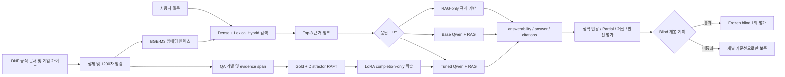

> 최신 통합 포트폴리오는 [PORTFOLIO.md](PORTFOLIO.md)입니다. 이 문서는 v2 실험 기록으로 유지합니다.

# DNF Domain QA SLM/RAG v2

## 평가 주도형 게임 도메인 QA 포트폴리오 보고서

> 던전앤파이터 공식 문서를 근거로 답하고, 근거가 부족하면 답변을 보류하는 한국어 도메인 QA 시스템

| 항목 | 내용 |
|---|---|
| 프로젝트 유형 | 데이터 구축 + RAG + SLM 미세조정 + 평가 설계 |
| 기준 모델 | Qwen2.5-0.5B-Instruct |
| 검색 구성 | BGE-M3 + dense/lexical hybrid |
| 최종 개발 기준선 | clean tuned Qwen checkpoint-250 |
| 데모 기본 모드 | RAG-only |
| 최종 검증 상태 | 개발셋 비교 완료, frozen blind 미개봉 |

**한 줄 결론:** tuned SLM은 base SLM보다 출력 형식, 인용, Partial 답변을 크게 개선했지만, 근거가 일부만 있는 질문에서 명시적으로 거절해야 할 부분을 충분히 처리하지 못해 최종 blind 평가는 열지 않았다.

---

## 1. 프로젝트 배경

기존 v1 `dnf-llm-eval`은 던파 문서를 검색해 LLM 답변이 좋아지는지를 확인하는 초기 실험이었다. 하지만 제목과 질문의 어휘 중복이 높고, 부모 문서 단위로 검색을 채점하며, 답변 불가·안전 질문과 학습 데이터 설계가 부족했다.

v2에서는 목표를 단순 챗봇 구현에서 다음과 같은 **평가 가능한 전체 파이프라인 구축**으로 확장했다.

1. 공식 문서·패치노트·공지·게임 가이드 수집 및 정제
2. intent, answerability, evidence를 포함한 QA 스키마 설계
3. BGE-M3 기반 검색과 chunk 단위 평가
4. 근거 부족·부분 근거·안전 질문에 대한 응답 정책
5. gold evidence와 distractor를 포함한 RAFT 학습 데이터 구축
6. Qwen LoRA 학습 및 RAG-only/base/tuned 비교
7. 누수 검사, blind 개봉 게이트, 실패 분석을 포함한 평가 체계
8. Gradio 비교 데모와 재현 가능한 보고서 제공

## 2. 핵심 질문

이 프로젝트는 다음 세 가지를 검증한다.

- 검색기가 질문에 필요한 **정확한 근거 청크**를 후보 안에 넣을 수 있는가?
- 소형 언어 모델이 검색 근거만 사용해 **답변·인용·거절 형식**을 지킬 수 있는가?
- 성능이 부족할 때 좋은 숫자를 선택하는 대신 **평가셋을 보호하고 실패 원인을 분리**할 수 있는가?

## 3. 시스템 구조



## 4. 구축 범위

### 데이터 엔지니어링

- 공식 게시판 문서의 반복 헤더와 boilerplate를 제거했다.
- flat한 게시판 글에는 section heuristic보다 고정 1200자 청킹이 더 안정적임을 A/B로 확인했다.
- 공식 문서와 게임 가이드를 합친 도메인 코퍼스는 1,307개 청크로 구성했다.
- QA에는 `gold_answer`, `evidence_span`, `expected_doc_id`, `expected_chunk_ids`, `answerability`, `intent`를 저장했다.
- train/dev/eval/blind를 parent document 기준으로 분리했다.

### 검색

- MiniLM의 128토큰 truncation 문제를 확인하고 BGE-M3로 전환했다.
- dense 검색과 lexical 점수를 결합한 hybrid ranking을 canonical로 선택했다.
- RRF, cross-encoder reranker, parent-window, contextual prefix를 같은 개발셋에서 비교했다.
- 성능이나 latency gate를 통과하지 못한 변형은 Gradio 기본 설정에 반영하지 않았다.

### SLM 학습

- train과 inference가 같은 prompt builder를 사용하도록 통일했다.
- `### Answer` 이후에만 loss를 적용하는 completion-only masking을 구현했다.
- gold evidence 위치를 섞어 첫 번째 문서만 복사하는 shortcut을 방지했다.
- false와 partial 예시를 포함해 답변, 인용, 거절 형식을 함께 학습했다.
- 최종 학습은 base Qwen2.5-0.5B에서 새로 시작해 2 epoch, 264 step을 완료했다.

### 평가와 데이터 거버넌스

- 검색 평가는 부모 문서가 아니라 gold chunk 기준 `hit_rate@k`와 MRR로 측정했다.
- 생성 평가는 schema compliance, exact citation, Partial joint, false joint, evidence support, unsafe answer를 함께 보았다.
- RAFT의 gold뿐 아니라 모든 distractor context까지 eval/blind 누수를 검사했다.
- frozen blind는 사전 정의한 개발 게이트를 통과할 때만 한 번 열도록 정책을 고정했다.

## 5. 최종 데이터 무결성

| 검사 항목 | 결과 |
|---|---:|
| 최종 QA | 408행 |
| 최종 RAFT | 576행 |
| RAFT 라벨 분포 | true 277 / partial 92 / false 207 |
| 학습 / 개발 분할 | 528 / 32 |
| train-dev parent overlap | 0 |
| train/dev/eval/blind parent·chunk·question overlap | 0 |
| RAFT context의 eval/blind overlap | 0 |
| gold evidence visibility | 369 / 369 |
| gold 위치 분포 | 117 / 124 / 128 |
| distractor 수 | 1,359 |
| exact/high-overlap answer distractor | 0 |
| 누락 문서 및 skipped 학습 행 | 0 |

이 검사는 단순한 ID 중복뿐 아니라 distractor 안에 정답 문장이 섞이는 **의미적 오염**까지 포함한다.

## 6. 주요 실험과 의사결정

| 실험 | 관찰 | 결정 |
|---|---|---|
| MiniLM → BGE-M3 | MiniLM에서 청크 대부분이 128토큰에 잘림 | BGE-M3로 전면 교체 |
| fixed chunk vs section chunk | flat한 게시판에서 fixed 1200이 더 안정적 | fixed 1200 채택 |
| 게시판 헤더 제거 | 답변 boilerplate 감소, hit@1·MRR 개선 | no-header 청크 승격 |
| hybrid vs RRF | RRF가 일관되게 낮음 | hybrid 유지 |
| hard negative | valid evidence가 negative로 섞여 거절 편향 발생 | answer-aware 필터 추가, 오염 arm 기각 |
| reranker | 일부 셋의 citation은 개선했지만 다른 셋과 false joint 악화 | 전역 정책으로 비채택 |
| parent ±1 window | fresh citation·evidence recall 하락, latency 약 4배 증가 | 비채택 |
| contextual prefix | domain/official retrieval 하락 | 비채택 |
| step 250 vs step 264 | step 264의 dev loss는 낮지만 citation·Partial 품질 하락 | end-task 지표로 step 250 선택 |

가장 중요한 교훈은 **dev loss나 단일 accuracy가 실제 QA 품질을 대표하지 않는다**는 점이다. 최종 체크포인트도 학습 완료 시점이 아니라 고정된 citation/Partial/거절 지표로 선택했다.

## 7. 최종 3축 비교

모든 생성 arm은 동일한 BGE-M3 hybrid 검색, `top_k=3`, `candidate_k=100`, 900자 query-aware context를 사용했다.

### 7.1 Fresh conversational dev 30문항

| 지표 | RAG-only | Base Qwen + RAG | Clean tuned Qwen + RAG |
|---|---:|---:|---:|
| schema compliance | 30/30 | 0/30 | 30/30 |
| answerable true 판정 | 16/16 | 0/16 | 15/16 |
| exact citation | 14/22 | 0/22 | 14/22 |
| Partial joint | 0/6 | 0/6 | 3/6 |
| false joint | 5/8 | 0/8 | 5/8 |
| unsafe answer | 0 | 안전 질문 2/2에서 발생 | 0 |
| retrieval expected hit | 21/22 | 21/22 | 21/22 |

### 7.2 Human-reviewed Partial dev 20문항

| 지표 | RAG-only | Base Qwen + RAG | Clean tuned Qwen + RAG |
|---|---:|---:|---:|
| schema compliance | 20/20 | 0/20 | 20/20 |
| exact citation | 6/20 | 0/20 | 12/20 |
| Partial joint | 0/20 | 0/20 | 8/20 |
| strict requirement joint | 0/20 | 0/20 | 3/20 |
| grounded and cited slots | 6/31 | 0/31 | 11/31 |
| unsupported explicit abstention | 0/21 | 0/21 | 8/21 |
| unsupported overanswer | 2/21 | - | 0/21 |

### 해석

- **RAG-only**는 빠르고 형식이 안정적이지만, 근거가 일부만 있는 질문을 `partial`로 분해해 답하지 못한다.
- **Base Qwen + RAG**는 그럴듯한 문장을 만들 수 있어도 지정 스키마와 인용을 지키지 못했고, 안전 질문에서 근거 없는 답을 생성했다.
- **Tuned Qwen + RAG**는 형식 준수, 정확 인용, Partial 처리에서 가장 강했다. 하지만 지원되지 않는 요구사항을 명시적으로 거절하는 비율이 아직 낮았다.

따라서 tuned checkpoint-250은 **가장 좋은 개발 기준선**이지만, 최종 검증이 끝난 배포 모델은 아니다.

## 8. Blind를 열지 않은 이유

사람이 검수하고 동결한 blind v1은 100문항(`true 60 / partial 20 / false 20`)이며, 개발 중 검색·생성 질의를 금지했다.

최종 checkpoint-250은 다음 두 사전 정의 게이트를 통과하지 못했다.

| Blind 개봉 전 게이트 | 요구값 | 결과 |
|---|---:|---:|
| fresh false joint | 7/8 이상 | 5/8 |
| unsupported explicit abstention | 14/21 이상 | 8/21 |

이에 따라 frozen blind를 조회하지 않았다. 이는 누락된 실험이 아니라 **평가셋을 소모하지 않기 위한 의도적인 release decision**이다.

이 프로젝트가 주장하는 최종 범위는 다음과 같다.

> BGE-M3 기반 RAG와 Qwen LoRA의 개발셋 비교, 데이터 누수 통제, 실패 원인 분석까지 완료한 개발 포트폴리오. Blind 검증과 production 성능은 주장하지 않는다.

## 9. 실패에서 얻은 기술적 교훈

1. **쉬운 평가셋은 검색기를 과대평가한다.** 제목 파생 질문을 본문 fact 기반 질문과 chunk 단위 채점으로 교체했다.
2. **answerability accuracy 하나로는 부족하다.** 라벨을 맞혀도 엉뚱한 청크를 인용할 수 있어 exact citation과 retrieval hit를 함께 봐야 한다.
3. **hard negative도 오염될 수 있다.** 다른 문서가 같은 사실을 반복하면 유효한 근거를 negative로 잘못 가르치게 된다.
4. **oracle은 종류를 구분해야 한다.** 정답 문장만 넣는 span oracle은 실제 noisy chunk 환경의 상한을 과장한다.
5. **낮은 dev loss가 더 좋은 모델을 뜻하지 않는다.** step 264보다 step 250의 end-task 품질이 높았다.
6. **Partial은 단일 라벨 문제가 아니다.** grounded slot을 답하고 인용하는 능력과 unsupported slot을 거절하는 능력을 각각 측정해야 한다.

## 10. 기술 스택

| 영역 | 기술 |
|---|---|
| 언어·런타임 | Python, PyTorch, CUDA |
| 임베딩 | Sentence-Transformers, BAAI/bge-m3 |
| 벡터 저장소 | ChromaDB |
| 검색 | dense similarity + lexical hybrid ranking |
| 기반 SLM | Qwen2.5-0.5B-Instruct |
| 학습 | Transformers, PEFT LoRA, completion-only masking |
| 데이터·검수 | JSONL, CSV, Label Studio 호환 포맷 |
| 데모 | Gradio |
| 검증 | unittest, compile, smoke, 데이터 누수·오염 validator |

## 11. 데모

Gradio는 다음 세 모드를 같은 화면에서 비교한다.

- `RAG-only`: 현재 기본 모드
- `Base SLM + RAG`: 미세조정 기여도 비교
- `Tuned SLM + RAG`: clean checkpoint-250 개발 기준선

화면에는 answerability, 구조화된 답변, citations, 검색 근거를 함께 표시한다.

```powershell
python app/gradio_app.py
```

기본 주소: `http://127.0.0.1:7860/`

## 12. 재현 방법

```powershell
python -m venv .venv
.\.venv\Scripts\Activate.ps1
pip install -r requirements.txt
pip install -r requirements-train.txt

python -m unittest discover -s tests -v
python src/run_smoke_tests.py
python src/validate_domain_dataset.py
```

최종 결과의 근거 파일:

- `docs/final_release_results.md`: 최종 기술 판정
- `reports/final_dev_system_comparison.json`: 3축 개발셋 비교
- `reports/final_random_control_release_decision.json`: 체크포인트 및 blind 게이트 결정
- `reports/final_random_control_training_manifest.json`: 최종 학습 설정
- `reports/final_random_control_data_manifest.json`: 데이터 무결성·분포
- `docs/agent_handoff.md`: 최신 상태와 금지 사항

## 13. 포트폴리오에서 보여주는 역량

### 데이터 중심 ML 엔지니어링

문서 수집부터 스키마, 라벨링, RAFT 생성, 사람 검수, 누수 검증까지 모델 밖의 데이터 품질 문제를 직접 다뤘다.

### 평가 주도 개발

좋아 보이는 단일 수치 대신 retrieval, citation, Partial, refusal, safety를 분리하고, 실험 전에 승격 기준을 고정했다.

### 실패 분석과 실험 통제

RRF, reranker, parent context, contextual prefix, hard negative를 무조건 채택하지 않고 같은 기준으로 A/B한 뒤 기각 또는 보류했다.

### 재현 가능한 의사결정

실험 결과를 JSON 보고서, manifest, SHA-256, Git 이력으로 남겼으며, 더 낮은 loss보다 실제 task metric이 좋은 체크포인트를 선택했다.

## 14. 현재 한계와 후속 연구

- frozen blind를 열 수 있을 정도로 unsupported abstention이 안정적이지 않다.
- Partial 질문에서 grounded slot 선택과 explicit refusal을 동시에 만족하는 비율이 낮다.
- 검색 hit가 높은데도 정확한 citation을 고르지 못하는 evidence selection 문제가 남아 있다.
- 실시간 시세, 계정 상태처럼 공식 정적 문서로 답할 수 없는 데이터 소스는 지원하지 않는다.
- LLM-RAG 축은 실제 API 기반 공정 비교가 연결되지 않아 최종 비교에서 제외했다.

후속 연구는 현재 release 결과를 덮어쓰지 않는 별도 브랜치에서, 사람이 검수한 **Partial 대 wholly-unsupported 대조 데이터**를 먼저 설계한 뒤 시작해야 한다.

---

## 최종 평가

이 프로젝트의 핵심 결과는 “작은 모델의 숫자를 높였다”가 아니다. 공식 문서 기반 QA 문제를 데이터, 검색, 학습, 평가로 분해하고, 누수와 지표 착시를 찾아 수정하며, 기준을 충족하지 못했을 때 blind 평가를 열지 않는 **신뢰 가능한 ML 개발 과정**을 구현한 것이다.
