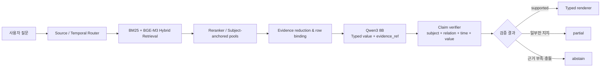

> 최신 통합 포트폴리오는 [PORTFOLIO.md](PORTFOLIO.md)입니다. 이 문서는 typed v3 실험 기록으로 유지합니다.

# 던파 공식문서 기반 RAG — Evidence Contract Engineering

> 상태: 포트폴리오 초안
> 기준일: 2026-07-27
> 핵심 모델: `qwen3-8b:ctx8192`
> 포트폴리오 공개: GO
> 제품 기본 경로 승격: NO-GO

## 1. 프로젝트 소개

던전앤파이터 공식 문서를 대상으로, 단순히 답을 생성하는 RAG가
아니라 검색된 근거와 최종 claim의 `subject · relation · 시점 · 값`을
검증하는 QA 파이프라인을 구축했습니다.

이 프로젝트에서 중요하게 본 것은 가장 높은 점수 하나가 아닙니다.

- 검색 실패와 생성 실패를 분리
- 최신 revision과 이벤트 기간을 반영
- 표의 상품·속성·값을 같은 행으로 연결
- 모델이 선택한 값과 인용 좌표를 서버가 검증
- 근거가 부족하거나 모호하면 partial/abstain
- sealed 일반화 결과와 adaptive 진단 결과를 분리
- 자동 채점 오류를 사람 근거 검수로 정정

## 2. 최종 연구 파이프라인



모델은 자유 인용문 대신 다음과 같은 typed output을 냅니다.

```json
{
  "requirement_id": "daily_reset_time",
  "status": "supported",
  "value_type": "time",
  "value": "06:00",
  "evidence_refs": ["E3"]
}
```

서버는 `E3`를 원문 좌표로 복원하고 다음을 검사합니다.

1. 실제 후보에 존재하는 evidence ref인가
2. `chunk_id/start_char/end_char`가 원문과 정확히 일치하는가
3. current revision과 요구한 temporal role이 맞는가
4. subject·relation·value가 같은 evidence group에서 지지되는가
5. 숫자·통화·날짜·시각이 정규화 후 일치하는가

## 3. 성능은 숫자의 위상을 분리해 보고

| 결과 | 완전 정답 | 위상 |
|---|---:|---|
| 공식 sealed one-shot | **37/64 (57.8%)** | 유일한 untouched 일반화 헤드라인 |
| Historical adaptive full-64 | 55/64 (85.9%) | 이미 본 개발 세트, 승격 불가 |
| Namespace-safe source-only value | 55/64 (85.9%) | 저장된 검증 결과의 최신 scorer 재채점 |
| Typed value complete | 48/64 (75.0%) | 요구별 typed value까지 완전 |
| Typed claim + 승인 직접 근거 | **43/64 (67.2%)** | 값과 승인 근거 좌표 모두 완전 |

`55/64`, `48/64`, `43/64`는 새 모델 일반화 점수가 아닙니다. 검색,
모델, verifier를 다시 실행하지 않은 post-hoc 진단이며 공식 headline은
계속 `37/64`입니다.

후보 회수는 다음과 같습니다.

| 후보 지표 | 결과 |
|---|---:|
| frozen gold 기준 | 62/64 |
| 사람 검수 동등 공식 근거 포함 | **64/64** |

후보에 근거가 있다는 사실은 reducer가 완전한 claim group을 보존하거나
모델이 정확한 값을 고른다는 뜻이 아닙니다.

## 4. 가장 중요한 발견

처음에는 검색이 주된 병목이라고 생각했습니다. 그러나 64문항을
재검수하자 남은 실패의 중심은 검색 이후였습니다.

```text
후보 회수
→ 모델에 보일 evidence로 축소
→ subject/relation/value 선택
→ verifier 해석
→ renderer
→ scorer
```

각 계층이 같은 claim schema를 사용하지 않으면 다음 문제가 생깁니다.

- 적용일 질문에 게시일을 선택
- 5주차 질문에 값이 같은 1주차 문서를 인용
- 전체 목록 중 일부만 답하고 full로 노출
- 같은 상품명의 형제 가격 행을 혼동
- typed text value를 renderer가 근거문으로 덮어씀
- 승인 span과 한 글자만 겹쳐도 직접 근거로 채점
- 과거 `E14`를 현재 프롬프트의 다른 `E14`로 재해석

## 5. 구현한 일반화 보완

### 공용 value contract

- number, currency, date, time, time range, boolean 정규화
- `daily_reset_time -> time`
- `maintenance_time -> time_range`
- `110`이 `1100`에 매칭되지 않도록 숫자 경계 적용
- strict typed 인용은 승인 근거와 겹치는 부분 안에 실제 값이 있어야 함

### 배치 출력 프로토콜

- 고정 requirement ID 또는 완전한 `1..N` ordinal만 허용
- typo·누락·중복·혼합 ID는 fail-closed
- 질문의 주차/회차/단계는 단일 요구이거나 모든 요구 relation이 같을
  때만 공통 적용
- mixed relation에서는 planner가 명시한 qualifier만 유지

### claim binding

- policy subject + revision/year + effective date
- monthly item month + record + attribute + value
- 하나의 evidence group 안에서 subject·relation·value 검증
- shop/monthly의 무기·오라·칭호·크리쳐 형제 타입 충돌 차단
- 통화가 여러 행에 존재하면 모호성을 해소하지 못한 답을 차단
- 명시적 `cardinality=all`은 전체성 증명 없이 노출 금지

### 재현 가능한 evidence namespace

새 typed 호출은 다음을 저장합니다.

```text
claim-contract version
E-ref → chunk_id/start_char/end_char
ordered namespace SHA-256
```

저장된 namespace가 없거나 현재 namespace와 다르면 verifier replay를
중단합니다. 과거 출력은 prompt를 재구축하지 않는 score-only 분석만
허용합니다.

## 6. 사람 재검수 결과

Namespace-safe historical source-only 분석에서 자동 semantic flag는
14건이었습니다. 모든 인용 좌표는 실제 원문과 일치했습니다.

| 사람 판정 | 문항 | 건수 |
|---|---|---:|
| 실제 제품 의미 false-full | **3, 30, 51** | **3** |
| 동등 공식 근거 / 좁은 gold 자동 오탐 | 4, 6, 29, 31, 33, 36, 43, 44, 46, 62, 64 | 11 |

대표 실제 오류:

1. 3번: 5주차 질문에 값이 같은 1주차 문서를 인용
2. 30번: `110, 115` 중 `115`만 답하고 full 처리
3. 51번: 조건이 다른 여러 가격 중 `15 골드 코인` 하나만 유일한
   가격처럼 노출

51번은 frozen gold도 `2,600 세라` 하나만 정답으로 둬 과도하게
좁았습니다. 이 질문은 가격 조건을 명시하거나 모든 가격을 답해야
합니다.

## 7. 최신 Qwen3 8B 표적 회귀

변경된 claim-contract v7로 네 문항을 새로 생성했습니다.

| 문항 | 결과 |
|---:|---|
| 3 | 5주차 근거와 4·12 정확 |
| 25 | 06:00과 주간 기준 정확 |
| 30 | 이번 생성에서는 110·115 모두 정확 |
| 51 | 잘못된 형제 가격 선택, verifier가 partial로 차단 |

집계:

```text
정답: 3/4
실제 false-full: 0
생성 오류: 0
새 회귀: 0
```

이는 표적 adaptive 진단입니다. 30번이 이번에 맞았다고 목록 완전성
문제가 해결된 것은 아닙니다. 현재 frozen ClaimSpec 자체에
`cardinality=all`이 없기 때문입니다.

## 8. 아직 제품 승격을 하지 않은 이유

- 96개 요구 중 explicit relation contract는 22개
- 74개 relation은 unvalidated이며 현재 audit-only fail-open
- 전체 목록을 증명하는 closed evidence group 규약이 없음
- canonical subject/product/revision/qualifier ontology가 불완전
- 일반 상품은 상품·revision·구매 방식·거래 타입·통화·속성·값을
  하나의 typed record로 완전히 묶지 못함
- 다중 요구에서 Qwen의 값 선택 안정성이 충분하지 않음
- 31·47번은 evidence addendum이 아니라 명시적 target correction 필요

따라서 현재 판정은 다음과 같습니다.

```text
포트폴리오 사례 공개: GO
제품 기본 경로 승격: NO-GO
새 untouched 32문항 실행: 아직 보류
Semantic fallback: 비활성 유지
```

## 9. 다음 개발 순서

1. relation registry 74개를 개별 문항이 아니라 schema family 단위로 확장
2. `cardinality=all`과 closed-group proof를 함께 정의
3. canonical subject/product/revision/qualifier identity 도입
4. requirement별 model-visible evidence sufficiency 측정
5. claim target correction addendum을 evidence addendum과 분리
6. 위 계약을 freeze한 뒤 새 32문항을 사람 검수·봉인
7. 기존 Arm과 claim-contract Arm을 최초 1회 A/B

## 10. 검증

- 전체 테스트: `853 passed`, `64 subtests`
- 표적 contract 테스트: `127 passed`, `17 subtests`
- dependency warning: 3
- 신규 Qwen 호출: 4
- 신규 생성 오류: 0
- 신규 false-full: 0
- sealed artifact: 변경 없음
- semantic fallback: 비활성

핵심 산출물:

- `reports/v3/typed_evidence_ref_claim_contract_round_20260727.md`
- `reports/v3/typed_evidence_ref_adaptive_source_addendum_rescore_v12_20260727.json`
- `reports/v3/typed_evidence_ref_adaptive_source_semantic_adjudication_v12_20260727.json`
- `reports/v3/typed_evidence_ref_claim_contract_qwen3_8b_smoke_slots3_25_30_51_v13_20260727.json`

### 이력서용 요약

> 던전앤파이터 공식 문서 QA RAG를 구축하고 BGE-M3 hybrid retrieval과
> Qwen3 8B typed evidence-ref 생성기를 결합했습니다. 64문항의 단계별
> 실패 분석을 통해 병목이 후보 회수보다 검색 이후 claim binding에
> 있음을 규명하고, 공용 value/ordinal/time contract, evidence-group
> 검증, fail-closed renderer, 재현 가능한 E-reference namespace를
> 구현했습니다. 공식 one-shot `37/64`와 adaptive/post-hoc 결과를
> 분리하고 자동 semantic flag 14건을 사람 검수해 실제 false-full
> 3건과 평가 오탐 11건을 구분했습니다.
